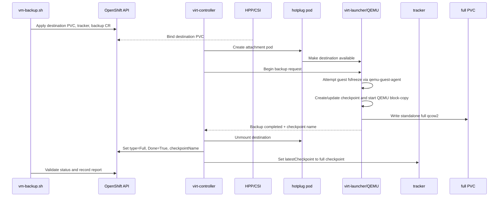

# 05. Full backup

## Purpose

The full backup establishes the first usable CBT checkpoint and writes a standalone qcow2 image.

## Objects applied

`make vm-backup` renders and applies:

```text
PVC vm-backup-pvc-<run>
VirtualMachineBackupTracker vm-tracker-<run>
VirtualMachineBackup vm-backup-<run>
  source.kind = VirtualMachineBackupTracker
  source.name = vm-tracker-<run>
  pvcName     = vm-backup-pvc-<run>
```

The tracker source points to the VM. The backup source points to the tracker so KubeVirt owns the checkpoint relationship.

## Full-backup sequence



## What to watch

1. Destination PVC reaches `Bound`.
2. `hp-volume-*` attachment pod is created.
3. Event `VolumeMountedToPod` appears.
4. `virt-launcher` logs `Backup begin called`, `Backup started`, and completion.
5. `VirtualMachineBackup.status.type` is `Full`.
6. `Done=True` reason is not a terminal failure reason beginning with `Backup has failed`.
7. `status.checkpointName` is non-empty.
8. Tracker `status.latestCheckpoint.name` equals the full checkpoint before starting the incremental stage.

`Done=True` alone is insufficient: KubeVirt can represent terminal failure through the Done reason, and a successful run can still carry a guest-freeze warning.

## Full image meaning

The full destination contains the baseline qcow2 image. It is the base required to reconstruct the VM state at the full checkpoint and to apply a later incremental overlay.
