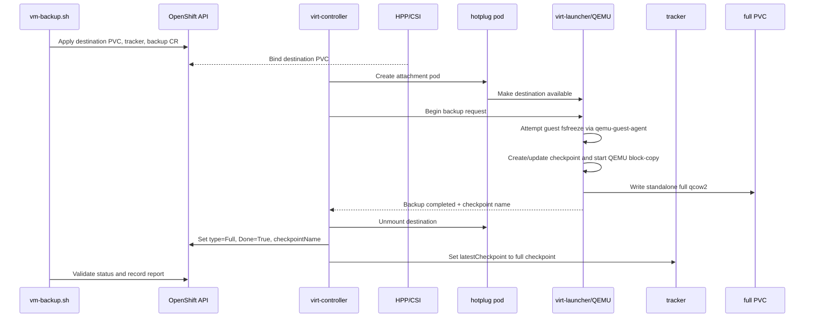

# 05. Full backup

## Purpose

The full backup establishes the first usable CBT checkpoint and writes a standalone qcow2 image.

## Objects applied

`make vm-backup` renders and applies:

```text
PVC vm-backup-pvc-<run>
VirtualMachineBackupTracker vm-tracker-<run>
VirtualMachineBackup vm-backup-<run>
  source.kind = VirtualMachineBackupTracker
  source.name = vm-tracker-<run>
  pvcName     = vm-backup-pvc-<run>
```

The tracker source points to the VM. The backup source points to the tracker so KubeVirt owns the checkpoint relationship.

## What happens inside the full backup

The live cloud05 large run showed this order:

1. The PVC was selected to the HPP node and an `hp-volume-*` attachment pod was created.
2. A first hotplug attempt could report `HotplugFailed` because the hostpath `disk.img` had not materialized yet; `VolumeMountedToPod` followed after retry.
3. `virt-controller` called the local backup API in the `virt-launcher` `compute` container.
4. `virt-launcher` froze the guest through qemu-guest-agent, then thawed it as soon as the backup job started. The freeze is a short consistency window, not the whole copy duration.
5. QEMU/libvirt copied the CBT-bearing disk chain into the hotplugged PVC while the guest continued running.
6. `virt-launcher` notified the controller with the checkpoint and included-volume result. The controller detached the PVC, updated status, and advanced the tracker.

For the observed large run, the full object was created at `12:50:38Z` and reached `Done=True` at `12:51:07Z`; this API duration includes PVC/hotplug/controller work, not only QEMU byte-copy time. The result included `vda`/`rootdisk`.

## Full-backup sequence



## Terminal status versus events

The CR normally settles with:

```text
Progressing=False, reason=Successfully completed VirtualMachineBackup
Done=True, reason=Successfully completed VirtualMachineBackup
status.type=Full
status.checkpointName=<non-empty>
status.includedVolumes=[diskTarget=vda, volumeName=rootdisk]
```

Cloud05 also produced `HotplugFailed` and, in other runs, `VirtualMachineBackupFailed` warning events close to a successful completion event. Events are append-only observations of intermediate reconciles; they are not the terminal result. Conversely, a `Done=True` condition can carry a terminal failure reason such as `Backup has failed: VMI backup status was lost`. Read the settled condition and reason, then restore the artifact.

## What to watch

1. Destination PVC reaches `Bound`.
2. `hp-volume-*` attachment pod is created.
3. Event `VolumeMountedToPod` appears.
4. `virt-launcher` logs `Backup begin called`, `Backup started`, and completion.
5. `VirtualMachineBackup.status.type` is `Full`.
6. `Done=True` reason is not a terminal failure reason beginning with `Backup has failed`.
7. `status.checkpointName` is non-empty.
8. Tracker `status.latestCheckpoint.name` equals the full checkpoint before starting the incremental stage.

`Done=True` alone is insufficient: KubeVirt can represent terminal failure through the Done reason, and a successful run can still carry a guest-freeze warning.

## Full image meaning

The full destination contains the baseline qcow2 image. It is the base required to reconstruct the VM state at the full checkpoint and to apply a later incremental overlay.
## Source-grounded failure and retry behavior

The controller starts the operation through [`handleBackupInitiation`](https://github.com/kubevirt/kubevirt/blob/v1.8.4/pkg/storage/cbt/backup.go#L590-L655), and the launcher validates CBT, constructs the full backup/checkpoint XML, and starts libvirt through [`BackupVirtualMachine`](https://github.com/kubevirt/kubevirt/blob/v1.8.4/pkg/virt-launcher/virtwrap/storage/backup.go#L58-L205). Important consequences:

- A missing VM/VMI, non-running VMI, migration, missing eligible volume, disabled CBT, missing/non-filesystem target PVC, or hotplug failure keeps initialization waiting or returns a controller error; the controller queue is rate-limited.
- A guest freeze failure does not necessarily fail the copy. It is saved as `backupMsg`; a successful copy with that warning becomes `CompletedWithWarning`.
- A libvirt failed job becomes terminal backup failure. In Push mode, a canceled job is also failed. The controller can still set `Done=True`, so the Done reason must be checked.
- The tracker is updated only after a completed, non-failed checkpoint. A failed full backup must not become the incremental base.

See [12. KubeVirt source reference](12-kubevirt-source-reference.md#control-plane-reconciliation) for finalizer, hotplug cleanup, status, abort, and tracker-update paths.
