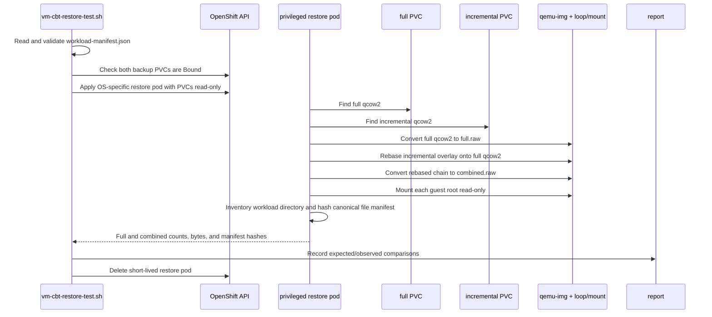

# 07. Restore verification

## Why the repository has its own restore test

The KubeVirt CBT API writes qcow2 artifacts but does not define a native restore API. A backup vendor or operator must reconstruct the chain. The repository verifies real data instead of trusting only `Bound`, `Done=True`, or `type=Incremental`.

## Restore sequence



## Assertions

| Restore | Expected count | Expected manifest |
|---|---:|---|
| Full-only | N | Baseline file-set digest |
| Full + incremental | N+M | Combined file-set digest |

The manifest digest covers sorted relative paths, exact byte sizes, and
per-file SHA-256 values. Matching counts alone is insufficient. The incremental
PVC is a delta; N+M is asserted only on the reconstructed full-plus-incremental
disk.

The helper uses `qemu-img convert`, `qemu-img rebase`, `losetup`, and read-only
ext4 or NTFS mounts. It requires a custom helper image, a privileged pod, and
access to the node's `/dev`.


## Artifact-level verification gap

The restore test proves semantic guest data, not the physical delta representation. It does not currently run `qemu-img info` or `qemu-img map` assertions on both artifacts, compare the incremental `backing-filename`, or compare allocated clusters. A malformed or unnecessarily full-sized incremental image could still pass if the reconstructed workload directory matches its manifest.

For a chaos test that claims CBT delta preservation, add a read-only artifact check before and after the injection:

```sh
qemu-img info <full.qcow2>
qemu-img info <incremental.qcow2>
qemu-img map --output=json <full.qcow2>
qemu-img map --output=json <incremental.qcow2>
```

Record the backing-file relationship, virtual size, actual file size, and allocated cluster map. Do not use file size alone as proof: qcow2 metadata, preallocation, compression, and filesystem allocation can change physical size.

## Security and scheduling requirements

The restore pod intentionally uses:

- `privileged: true`;
- a `/dev` hostPath;
- both backup PVCs mounted read-only;
- an `emptyDir` work volume.

Cloud05 emitted PodSecurity restricted warnings but allowed the pod. A cluster enforcing the restricted profile can reject it unless the namespace/SCC policy explicitly allows the operation.

## What this proves and does not prove

It proves the baseline workload file set is reconstructed from the full artifact and the N+M file set from the full-plus-incremental artifacts. The manifest comparison checks paths, sizes, and per-file hashes.

It does not prove:

- a reconstructed VM boots;
- qcow2 cluster allocation independently proves a delta rather than a complete recopy;
- the chain survives a real node/VMI/controller failure;
- the artifacts have been replicated off cluster.

For manual commands and an independently rendered pod manifest, see [`../restore-verification.md`](../restore-verification.md).
## Upstream boundary

The absence of a native restore API is an API/design boundary, not a missing step in this repository. The backup CRD and status contract are defined in [KubeVirt API types](12-kubevirt-source-reference.md#crd-and-api-contract); the Push/backup engine ends in the [launcher storage path](12-kubevirt-source-reference.md#node-local-runtime-and-qemulibvirt-path). The repository's `qemu-img` reconstruction is therefore an external consumer of the artifacts, not a KubeVirt controller behavior.
