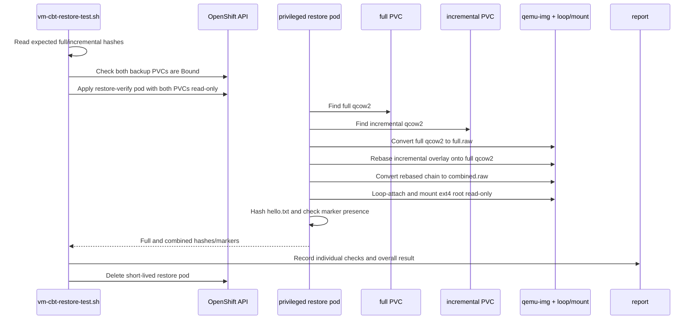

# 07. Restore verification

## Why the repository has its own restore test

The KubeVirt CBT API writes qcow2 artifacts but does not define a native restore API. A backup vendor or operator must reconstruct the chain. The repository verifies real data instead of trusting only `Bound`, `Done=True`, or `type=Incremental`.

## Restore sequence

## Assertions

| Restore | Expected hash | Marker |
|---|---|---|
| Full-only | Hash captured before guest mutation | Absent |
| Full + incremental | Hash captured after guest mutation | Present |

The helper uses `qemu-img convert`, `qemu-img rebase`, `losetup`, and a read-only ext4 mount. It requires a custom image built from `images/restore-helper/Dockerfile`, a privileged pod, and access to the node's `/dev`.

## Security and scheduling requirements

The restore pod intentionally uses:

- `privileged: true`;
- a `/dev` hostPath;
- both backup PVCs mounted read-only;
- an `emptyDir` work volume.

Cloud05 emitted PodSecurity restricted warnings but allowed the pod. A cluster enforcing the restricted profile can reject it unless the namespace/SCC policy explicitly allows the operation.

## What this proves and does not prove

It proves the actual guest file can be reconstructed from the full and incremental artifacts, including the incremental marker transition.

It does not prove:

- a reconstructed VM boots;
- qcow2 cluster allocation independently proves a delta rather than a complete recopy;
- the chain survives a real node/VMI/controller failure;
- the artifacts have been replicated off cluster.

For manual commands and an independently rendered pod manifest, see [`../restore-verification.md`](../restore-verification.md).
